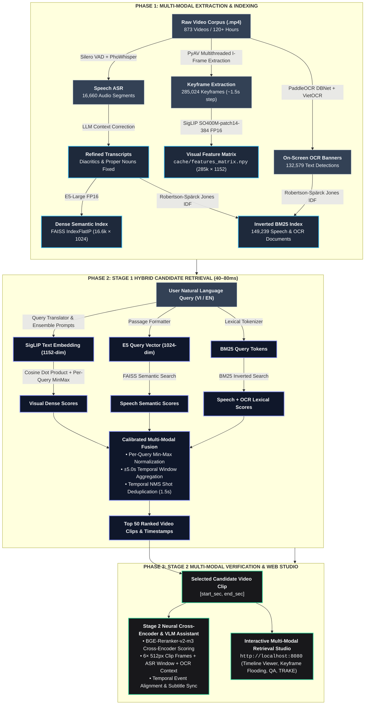

# Multi-Modal Video Retrieval Studio

An end-to-end, high-throughput multi-modal video retrieval and analysis platform.

The system combines **SigLIP-SO400M dense visual feature search (1152-dim)**, **LLM-refined PhoWhisper ASR speech transcription**, **intfloat/multilingual-e5-large dense semantic text search**, **Hybrid PaddleOCR + VietOCR on-screen text extraction**, **BAAI/bge-reranker-v2-m3 neural cross-encoder reranking**, **BM25 inverted lexical indexing**, and an interactive real-time web studio for **KIS (Known-Item Search)**, **Q&A**, and **TRAKE (Temporal Action Event Localization)**.

---

## 🌟 Core Features & Architecture



### 1. 🖼️ Dense Visual Search (SigLIP-SO400M)
- **Model:** `google/siglip-so400m-patch14-384` (1152-dimensional L2-normalized FP16 embeddings).
- **Index:** High-throughput matrix dot product and FAISS FlatIP index over **285,024 keyframes** (100% of 873 videos).
- **Decoupled Architecture:** Dedicated `SiglipVisionModel` (1.3s load time) and `SiglipTextModel` with prompt ensemble generation and automated Vietnamese $\leftrightarrow$ English translation.
- **Per-Query Normalization:** Clean min-max normalization across candidate keyframes eliminating scale mismatch.

### 2. 🗣️ Conservative LLM Transcript Refinement
- **100% Corpus Refinement:** All 873 video transcripts (16,660 segments) processed.
- **Segment Tagging (`<SEGMENT_i>`):** Strictly preserves temporal boundaries and video start/end timestamps.
- **Error Correction:** Fixes missing Vietnamese diacritics, phonetic homophones, and misheard proper nouns without hallucination.

### 3. 🧠 Dense Semantic Speech Indexing (Multilingual-E5 & BGE Reranker)
- **Dense Embedding:** `intfloat/multilingual-e5-large` (1024-dim, FP16 GPU accelerated) indexed in FAISS IndexFlatIP.
- **Neural Cross-Encoder:** `BAAI/bge-reranker-v2-m3` cross-encoder for fine-grained relevance reranking and context expansion.

### 4. 🔤 Hybrid OCR Text Extraction (PaddleOCR + VietOCR)
- **Two-Stage Architecture:**
  - **Detection:** PaddleOCR DBNet for fast, high-precision bounding box text detection.
  - **Recognition:** VietOCR Seq2Seq Transformer for native Vietnamese character and diacritics recognition.
- **Index Coverage:** Ingests **132,579 merged OCR banner segments** across 873 videos into the unified BM25 index.

### 5. 🎯 Multi-Modal Fusion & Temporal NMS
- **Linear Fusion Configurations:** Clean static presets (ASR-Heavy `0.30/0.70`, Balanced `0.70/0.30`, Dense-Heavy `0.85/0.15`) and Binary Evidence Gating.
- **Temporal Alignment:** Maps segment-level transcript and OCR scores to keyframe timestamps with $\pm 5.0\text{s}$ window aggregation.
- **Shot Deduplication / NMS:** Temporal NMS across keyframes within $1.5\text{s}$ to maximize Recall@K diversity.

---

## 📂 Data & Directory Layout

```text
├── data/                                 # Video datasets and official challenge metadata
│   ├── Videos_L21_a/video/*.mp4          # Video batches (L21 to L30, 873 videos)
│   ├── ...
│   ├── map-keyframes-aic25-b1/           # Keyframe timestamp mapping CSVs (pts_time, fps, frame_idx)
│   ├── media-info-aic25-b1/              # Video duration, resolution, codecs
│   └── objects-aic25-b1/                 # Precomputed object detection annotations
│
├── cache/                                # Precomputed feature matrices and indexed metadata
│   ├── features_matrix.npy               # SigLIP-SO400M visual matrix (285,024 × 1152)
│   ├── faiss_siglip_meta.pkl             # Global keyframe metadata records (285,024 entries)
│   ├── faiss_siglip.index                # Indexed visual FAISS FlatIP index
│   ├── asr_transcripts/                  # 873 raw ASR speech transcript JSON files
│   ├── asr_transcripts_refined/          # 873 LLM-refined ASR transcript JSON files
│   ├── transcript_embeddings.npy         # Dense E5-large transcript embeddings (16,660 × 1024)
│   ├── transcript_semantic.index         # FAISS dense vector index for transcripts
│   ├── transcript_semantic_meta.pkl      # Transcript segment metadata ledger
│   ├── ocr_text/                         # 873 Hybrid PaddleOCR + VietOCR extracted JSON files
│   └── thumbnails/                       # Extracted/cached frame previews
│
├── scripts/                              # Processing, extraction & indexing scripts
│   ├── extract_siglip_features.py        # PyAV multithreaded fast SigLIP-SO400M extractor
│   ├── run_dual_gpu.sh                   # Standalone dual-GPU orchestrator with disk streaming logs
│   ├── build_faiss_index.py              # Incremental FAISS builder for SigLIP embeddings
│   ├── build_transcript_index.py         # Build dense FAISS index with E5-Large over refined transcripts
│   ├── extract_whisper_asr.py            # Batch audio extraction & PhoWhisper speech transcription
│   ├── refine_transcripts_qwen.py        # Local Qwen2.5/Qwen3 LLM transcript refinement
│   ├── extract_ocr.py                    # On-screen text extraction via PaddleOCR + VietOCR
│   └── share_ngrok.py                    # Public tunnel helper for remote hosting
│
├── src/                                  # Core library modules
│   ├── encoding/                         # SigLIP vision encoder, E5 transcript encoder, OCR extractor
│   ├── index/                            # Frame mapper, semantic indexer, metadata indexer
│   ├── query/                            # Query translator, prompt ensembling, SigLIP text encoder
│   ├── retrieval/                        # Tri-modal fusion, hybrid transcript engine, video decoder
│   └── ui/                               # Search web studio (HTTP server + Tailwind frontend)
│       └── search_app.py
│
├── eval/                                 # Rigorous dual benchmark suite
│   ├── fast_dual_benchmark.py            # High-speed vectorized dual benchmark evaluation runner
│   ├── vietnamese_retrieval_benchmark_stage2_rigorous.jsonl  # 627 ASR/multimodal queries
│   └── visual_benchmark_from_raw_frames_1024x576.jsonl       # 800 Visual-focused queries
│
└── training_notebook.ipynb               # Multi-GPU training and feature extraction notebook
```

---

## ⚡ Precomputed Cache Download

To run the search studio without having to re-extract all keyframes, visual embeddings, OCR, and ASR transcripts (~873 videos):

📥 **Google Drive Cache Folder:**  
🔗 [**Download Cache Directory (Google Drive)**](https://drive.google.com/drive/folders/1Xr6YYo7p13c8gIalcjV8634b1g7mZUbA?usp=sharing)

### Quick Setup:
1. Download the files or `cache.zip` from the link above.
2. Extract the contents directly into the project root `cache/` directory:
   ```bash
   unzip cache.zip -d cache/
   ```

---

## 🚀 Installation & Environment Setup

### 1. Requirements
- Python >= 3.10
- PyTorch >= 2.0 with CUDA support
- PyAV, OpenCV, Pillow, Transformers, Accelerate, FAISS

### 2. Environment Setup (Conda / Pip)
```bash
# Clone the repository
git clone https://github.com/TotallyNotMinh/aic2026.git
cd aic2026

# Create and activate environment
conda create -n aic2026 python=3.11 -y
conda activate aic2026

# Install PyTorch with CUDA support
pip install torch torchvision torchaudio --index-url https://download.pytorch.org/whl/cu121

# Install core dependencies
pip install transformers accelerate bitsandbytes sentencepiece protobuf \
            av opencv-python pillow numpy tqdm faiss-cpu
```

---

## 🖥️ Launching the Search Studio Web App

Start the multi-modal search engine server:

```bash
python src/ui/search_app.py
```

- **Local URL:** `http://localhost:8080`
- **Search Capabilities:**
  - **Tri-Modal Fusion:** Combined SigLIP visual embeddings + BM25 lexical search + E5 dense semantic matching on refined transcripts.
  - **Live Subtitle Display:** Automatic temporal alignment displaying speech dialogue below each video card.
  - **Interactive Modal Video Player:** Live timestamp tracking, subtitle sync, speed control, and one-click submission copying (`VideoID,FrameIdx`).
  - **Task Modes:**
    - **KIS (Known-Item Search):** Keyframe pinning, relevance feedback, negative refinement, neighbor frame flooding.
    - **Q&A Mode:** In-line answer input, character counters, and question package management.
    - **TRAKE Mode:** Temporal event sequence marker with multi-frame segment saving.

### Public Access via Ngrok (Optional)
```bash
python scripts/share_ngrok.py --port 8080
```

---

## 🛠️ Offline Indexing & Processing Commands

### 1. Build Dense Semantic Transcript Index (E5-Large)
```bash
python scripts/build_transcript_index.py \
    --refined-dir cache/asr_transcripts_refined \
    --raw-dir cache/asr_transcripts \
    --model intfloat/multilingual-e5-large \
    --batch-size 64 \
    --device cuda
```

### 2. Run Multi-GPU ASR Transcript Refinement
```bash
# Dual-GPU Parallel Runner (Kaggle or local 2x GPU node)
python scripts/run_dual_gpu_refinement.py \
    --model-id Qwen/Qwen2.5-1.5B-Instruct \
    --batch-size 12 \
    --num-gpus 2
```

### 3. Extract Speech Transcripts (PhoWhisper)
```bash
python scripts/extract_whisper_asr.py \
    --device cuda:0 \
    --model-size vinai/PhoWhisper-small \
    --batch-size 32
```

### 4. Extract SigLIP Visual Embeddings (Fast PyAV Multi-Threaded)
```bash
# Single GPU
python scripts/extract_siglip_features.py \
    --device cuda:0 \
    --batch-size 64 \
    --num-workers 3

# Dual-GPU Parallel Runner
bash scripts/run_dual_gpu.sh
```

### 5. Build Unified FAISS Index
```bash
python scripts/build_faiss_index.py
```

### 6. Run Dual Retrieval Benchmark
```bash
python eval/fast_dual_benchmark.py
```

---

## 📝 License & Competition Notes
Developed for the **Ho Chi Minh City AI Challenge (AIC) 2026**.
