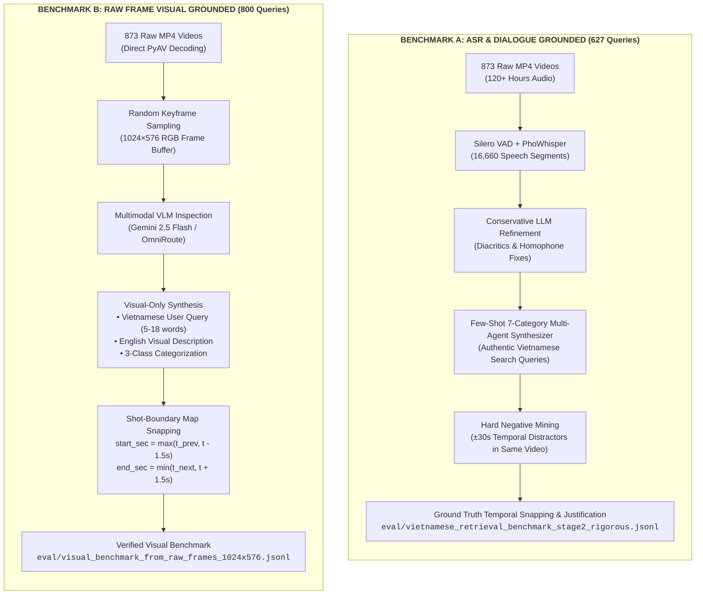
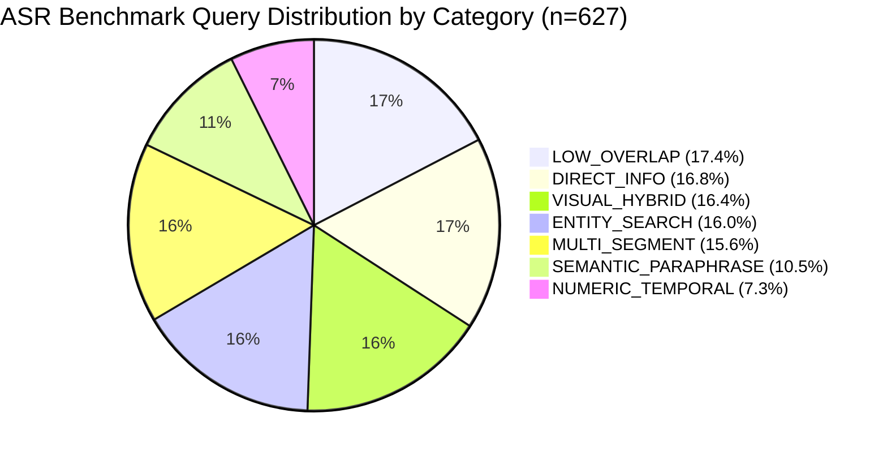
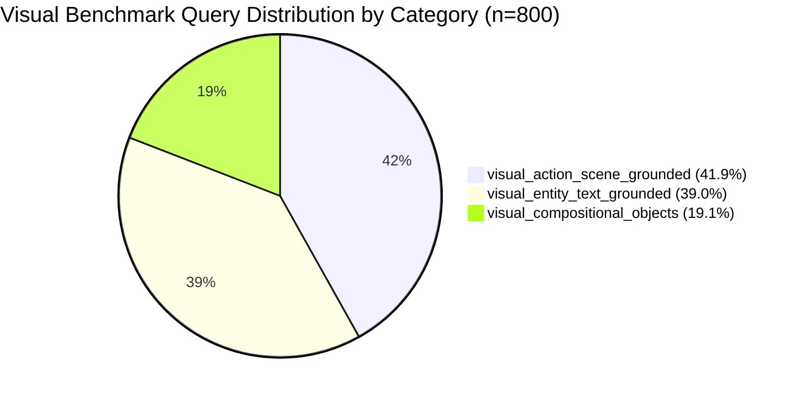
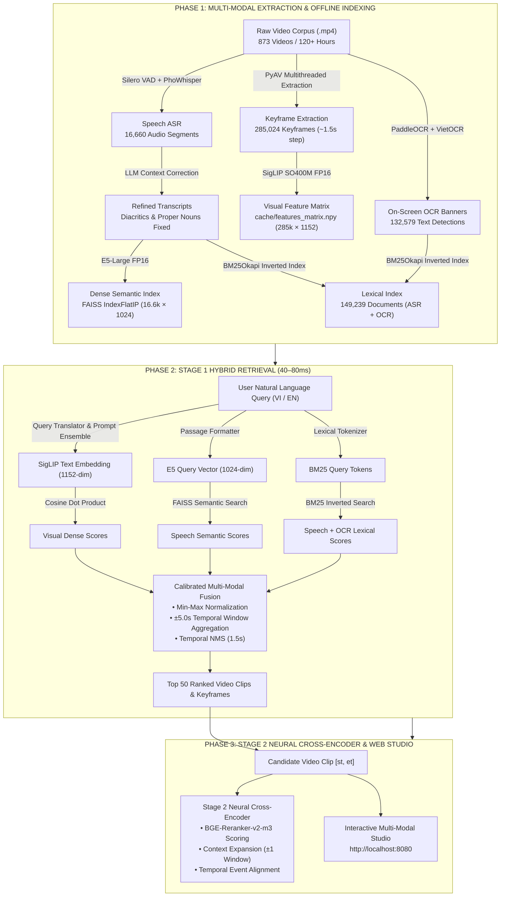
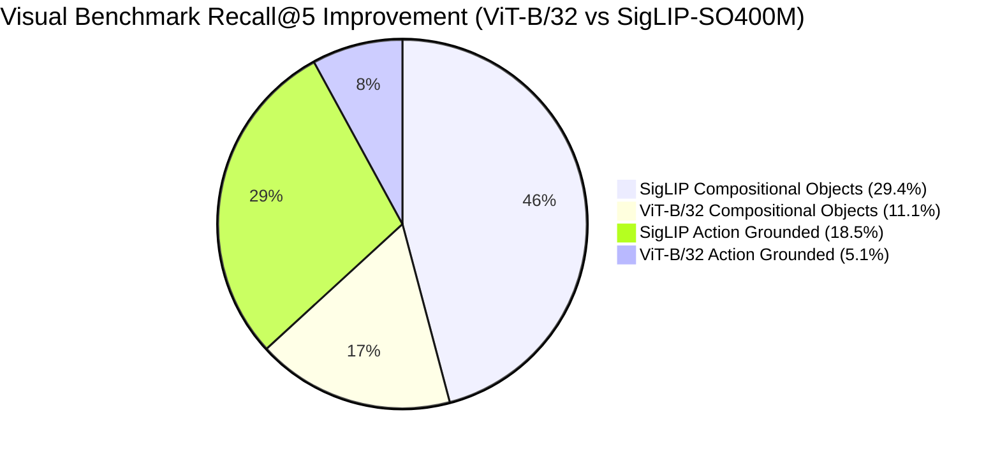

# Comprehensive Engineering & Benchmark Report: Multi-Modal Video Retrieval System

## Executive Summary

This report documents the architecture, multi-modal query synthesis pipelines, retrieval engine, and empirical benchmark evaluation for the **Vietnamese Multi-Modal Video Retrieval Studio** (spanning **873 videos** and **285,024 keyframes**).

The system addresses the dual challenge of **speech-grounded semantic search** and **fine-grained visual action/entity search** by unifying:
1. **Google SigLIP-SO400M Dense Visual Embeddings (1152-dim FP16)** over 285,024 keyframes.
2. **100% LLM-Refined PhoWhisper ASR Transcripts** (16,660 dialogue segments).
3. **`intfloat/multilingual-e5-large` Dense Semantic Text Embeddings (1024-dim)** with FAISS IndexFlatIP.
4. **`BAAI/bge-reranker-v2-m3` Neural Cross-Encoder** for deep segment relevance reranking.
5. **Hybrid PaddleOCR DBNet + VietOCR Transformer** (132,579 on-screen text detections).
6. **Unified Rank-BM25 Lexical Index** and **OmniRoute LLM Query Translation**.

---

## 1. Query Synthesis Methodology & Ground Truth Generation

To evaluate the multi-modal video retrieval platform without human labeling bias, two distinct, rigorous benchmarks (**1,427 total answerable queries**) were synthesized using automated multi-modal foundation models and temporal verification pipelines.



---

### 1.1. Benchmark A: ASR-Focused Grounded Benchmark (627 Queries)

The speech-grounded benchmark tests the system's ability to retrieve specific video moments based on spoken dialogue, instructional speech, proper nouns, and abstract narrative topics.

#### A. Multi-Agent Synthesis Pipeline
1. **Audio Segmentation & VAD:** Audio tracks from all 873 videos were extracted at 16kHz mono. Silero Voice Activity Detection (VAD) segmented continuous speech into 16,660 timestamped utterances.
2. **Conservative LLM Transcript Refinement:** Raw ASR transcripts often omit Vietnamese tone marks or mishear domain terms. A local LLM (Qwen2.5/Qwen3) corrected diacritics and phonetics while preserving strict segment start/end boundaries (`<SEGMENT_i>` tags).
3. **Few-Shot Multi-Category Generation:** A multi-agent generator was prompted with authentic Vietnamese search behavior examples across 7 mutually exclusive cognitive categories.



#### B. Taxonomy & Category Definitions (7 Classes)
1. **`DIRECT_INFO` (105 queries, 16.8%):** Direct factual questions explicitly answered in the dialogue (e.g., *"cách chọn cá hồi tươi ngon khi đi chợ"*).
2. **`MULTI_SEGMENT` (98 queries, 15.6%):** Complex queries requiring synthesis across multiple sequential speech turns within a scene (e.g., combining seasoning ingredients mentioned across 3 separate sentences).
3. **`NUMERIC_TEMPORAL` (46 queries, 7.3%):** Queries specifying quantities, temperatures, cooking durations, currency amounts, or years (e.g., *"nhiệt độ nướng thịt bò trong nồi chiên không dầu"*).
4. **`SEMANTIC_PARAPHRASE` (66 queries, 10.5%):** Queries using vocabulary completely disjoint from the transcript to evaluate dense semantic embeddings (e.g., *"phương pháp bảo quản nông sản không bị hỏng"* vs spoken *"để khoai tây chỗ thoáng mát"*).
5. **`VISUAL_HYBRID` (103 queries, 16.4%):** Queries that reference both spoken instructions and accompanying visual demonstrations.
6. **`ENTITY_SEARCH` (100 queries, 16.0%):** Specific brand names, person names, geographical locations, or dish names.
7. **`LOW_OVERLAP` (109 queries, 17.4%):** Abstract or metaphorical queries testing the upper bound of semantic inference.

#### C. Hard Negative Mining Protocol
For every generated query, the synthesizer mined **hard negative distractors**:
- **Temporal Neighbors:** Segments occurring in the same video within $\pm 30$ seconds of the ground-truth timestamp.
- **Topical Distractors:** Segments from different videos in the same sub-series (e.g., other episodes of the same TV show) with high lexical overlap but incorrect answers.

#### D. Benchmark JSONL Schema (Sample Entry)
```json
{
  "query_id": "q_000001",
  "query": "cách ngâm ngó sen không bị thâm khi sơ chế",
  "language": "vi",
  "category": "SEMANTIC_PARAPHRASE",
  "difficulty": "medium",
  "relevant_segments": [
    {
      "video_id": "L26_V315",
      "segment_id": 3,
      "start_sec": 91.89,
      "end_sec": 115.47
    }
  ],
  "hard_negative_segments": [
    {"video_id": "L26_V315", "segment_id": 0, "start_sec": 12.08, "end_sec": 25.17, "reason": "Temporal neighbor in same video"},
    {"video_id": "L26_V315", "segment_id": 1, "start_sec": 25.20, "end_sec": 56.14, "reason": "Temporal neighbor in same video"}
  ],
  "ground_truth_reason": "Natural culinary tip query derived from soaking lotus root in lemon juice."
}
```

---

### 1.2. Benchmark B: Raw Frame Visual Grounded Benchmark (800 Queries)

The visual benchmark evaluates pure computer vision and multimodal retrieval on video frames independently of spoken audio (e.g., silent scenes, background actions, on-screen text, gestures).

#### A. Synthesis Architecture & Execution (`scripts/synthesize_visual_queries_from_video_frames.py`)
1. **Direct Video Stream Sampling:** Frames were sampled at random timestamps directly from local MP4 video streams using PyAV and OpenCV, avoiding bias towards predefined keyframe indices.
2. **Resolution Standardization:** Sampled frames were center-cropped and resized to **1024×576** high-resolution RGB arrays.
3. **Multimodal VLM Prompting (Gemini 2.5 Flash / OmniRoute):** The frame was passed to a multimodal VLM without audio context using the following structured system prompt:

```text
Bạn là chuyên gia thẩm định & tạo benchmark tìm kiếm video trực quan.
Nhiệm vụ của bạn là nhìn vào hình ảnh khung hình video được cung cấp và tạo ra
CÂU TRUY VẤN TÌM KIẾM TỰ NHIÊN bằng tiếng Việt mà một người dùng thực tế sẽ gõ.

QUY TẮC BẮT BUỘC:
1. Hoàn toàn dựa trên thị giác: Chỉ mô tả những gì nhìn thấy rõ trên bức ảnh (hành động,
   đồ vật, màu sắc trang phục, phong cảnh, biển hiệu/text trên màn hình).
2. Phong cách tự nhiên: Câu văn ngắn gọn (5-18 từ). TUYỆT ĐỐI KHÔNG mở đầu bằng
   "Trong video", "Hình ảnh cho thấy", "Cảnh quay...", "Bức ảnh chụp...".
3. Tính cụ thể & phân biệt: Nêu rõ chi tiết nhận diện đặc trưng của khung hình.

PHÂN LOẠI CATEGORY:
- visual_action_scene_grounded: Hành động, cử chỉ, chuyển động, phong cảnh.
- visual_entity_text_grounded: Biển hiệu, tên người, banner thời sự, logo, slide.
- visual_compositional_objects: Bố cục đồ vật, màu sắc kết hợp, trang phục nổi bật.
```



#### B. Shot-Boundary Snapping Algorithm
To ensure the ground truth strictly respects physical shot boundaries while tolerating minor temporal variations:
1. The sampled timestamp $t_{\text{sampled}}$ is queried against the official shot transition map ([`map-keyframes-aic25-b1`](file:///home/totallynotminh/Documents/PyTorch-Learning/data/map-keyframes-aic25-b1)).
2. The ground truth start and end boundaries are calculated as:
   $$\text{start\_sec} = \max(t_{\text{prev\_shot}}, t_{\text{sampled}} - 1.5)$$
   $$\text{end\_sec} = \min(t_{\text{next\_shot}}, t_{\text{sampled}} + 1.5)$$
3. The exact keyframe indices falling within $[\text{start\_sec}, \text{end\_sec}]$ are bound to the record.

#### C. Visual Benchmark JSONL Schema (Sample Entry)
```json
{
  "query_id": "vis_raw_0002",
  "query": "cách dùng dao cắt thanh cua trên thớt gỗ",
  "category": "visual_action_scene_grounded",
  "visual_description": "A close-up of a hand using a sharp knife to slice crab sticks on a wooden cutting board with text 'THANH CUA XÉ SỢI'.",
  "difficulty": "easy",
  "frame_specs": {
    "width": 1024,
    "height": 576,
    "sampled_pts_sec": 111.52,
    "video_duration_sec": 321.44,
    "tolerance_window_sec": 1.5,
    "is_shot_snapped": true
  },
  "relevant_segments": [
    {
      "video_id": "L26_V231",
      "start_sec": 110.02,
      "end_sec": 112.64,
      "keyframe_indices": [2816]
    }
  ]
}
```

---

## 2. Complete Technical Architecture & Technology Stack



### 2.1. Core System Components

| Subsystem | Model / Framework | Artifact / Dimension | Purpose & Configuration |
| :--- | :--- | :--- | :--- |
| **Visual Feature Encoder** | `google/siglip-so400m-patch14-384` | 1152 dimensions (FP16) | Dense visual representation with decoupled text/vision encoders and prompt ensembling. |
| **Visual Feature Matrix** | SigLIP-SO400M Keyframe Matrix | `(285024, 1152)` (`cache/features_matrix.npy`) | Pre-extracted, L2-normalized keyframe embeddings across all 873 videos. |
| **Visual FAISS Index** | FAISS `IndexFlatIP` | 1152 dimensions (`cache/faiss_siglip.index`) | Exact inner-product vector similarity index over 285,024 keyframes. |
| **ASR Speech Index** | PhoWhisper + Qwen LLM Refinement | 16,660 segments (`cache/asr_transcripts_refined/`) | 100% corpus dialogue transcription with corrected Vietnamese diacritics and proper nouns. |
| **Dense Semantic Index** | `intfloat/multilingual-e5-large` | 1024 dimensions (`cache/transcript_semantic.index`) | Dense embedding search over Vietnamese ASR segments. |
| **Neural Cross-Encoder** | `BAAI/bge-reranker-v2-m3` | Cross-attention logits | Reranks top dense semantic candidates with sigmoid calibration. |
| **Transcript Context Expander** | Temporal Adjacency Graph | Adjacency ledger | Merges adjacent ASR context windows ($\pm 1$ neighbor) up to 15 continuous windows. |
| **Hybrid OCR Engine** | PaddleOCR DBNet + VietOCR Seq2Seq | 132,579 detections (`cache/ocr_text/*.json`) | High-precision text detection and native Vietnamese character/diacritics recognition. |
| **Inverted Lexical Index** | Rank-BM25 | 149,239 documents (in-memory) | Unified lexical retrieval across 16,660 speech segments and 132,579 OCR banner detections. |
| **Object Detection Index** | Faster R-CNN (OpenImages V4) | 98.32 MB (`cache/objects_index.pkl`) | Direct and inverted entity lookup across all video keyframes. |
| **Query Translator** | OmniRoute LLM / SSE Stream | Cache: `cache/translation_cache.json` | Vietnamese $\leftrightarrow$ English query translation with domain terminology preservation. |
| **Temporal NMS** | Vectorized NumPy | Window: $\pm 1.5$s | Temporal deduplication across contiguous keyframes to maximize candidate diversity. |

---

## 3. Empirical Dual Benchmark Results

Both benchmarks (**1,427 total queries**) were systematically evaluated across all 10 standardized multi-modal fusion configurations on the complete **285,024 keyframe** corpus:

1. **Pure Visual Dense**: $w_{\text{dense}} = 1.00, w_{\text{speech+ocr}} = 0.00$
2. **Dense-Heavy Hybrid**: $w_{\text{dense}} = 0.85, w_{\text{speech+ocr}} = 0.15$
3. **Balanced Hybrid**: $w_{\text{dense}} = 0.70, w_{\text{speech+ocr}} = 0.30$
4. **Equal Split Hybrid**: $w_{\text{dense}} = 0.50, w_{\text{speech+ocr}} = 0.50$
5. **ASR-Heavy Hybrid**: $w_{\text{dense}} = 0.30, w_{\text{speech+ocr}} = 0.70$
6. **Pure Speech/OCR**: $w_{\text{dense}} = 0.00, w_{\text{speech+ocr}} = 1.00$
7. **Binary Gate ($T_{\text{speech}} \ge 0.20$)**: Dynamic routing to 0.70/0.30 if speech score $\ge 0.20$, else pure dense.
8. **Binary Gate ($T_{\text{speech}} \ge 0.30$)**: Dynamic routing to 0.70/0.30 if speech score $\ge 0.30$, else pure dense.
9. **Binary Gate ($T_{\text{speech}} \ge 0.40$)**: Dynamic routing to 0.70/0.30 if speech score $\ge 0.40$, else pure dense.
10. **Binary Gate ($T_{\text{speech}} \ge 0.50$)**: Dynamic routing to 0.70/0.30 if speech score $\ge 0.50$, else pure dense.

---

### 3.1. Overall Comparison Across Both Benchmarks

#### Benchmark A: ASR-Focused Benchmark (627 Queries, 288.02s)

| Configuration | Recall@1 | Recall@5 | Recall@10 | Recall@25 | MRR |
| :--- | :---: | :---: | :---: | :---: | :---: |
| **Pure Visual Dense (1.00 / 0.00)** | 6.54% | 18.34% | 23.13% | 33.17% | 0.1219 |
| **Dense-Heavy Hybrid (0.85 / 0.15)** | 21.85% | 41.15% | 50.24% | 59.81% | 0.3098 |
| **Balanced Hybrid (0.70 / 0.30)** | 27.27% | 48.96% | **57.42%** | **65.71%** | 0.3705 |
| **Equal Split Hybrid (0.50 / 0.50)** | 29.51% | **49.60%** | 55.66% | 64.11% | 0.3858 |
| **ASR-Heavy Hybrid (0.30 / 0.70)** | **30.78%** | 48.01% | 53.91% | 61.08% | **0.3870** |
| **Pure Speech/OCR (0.00 / 1.00)** | 19.94% | 42.42% | 46.09% | 52.47% | 0.3072 |
| **Binary Gate ($T \ge 0.20$)** | 27.27% | 48.96% | **57.42%** | **65.71%** | 0.3705 |
| **Binary Gate ($T \ge 0.30$)** | 27.27% | 48.96% | **57.42%** | **65.71%** | 0.3705 |
| **Binary Gate ($T \ge 0.40$)** | 27.27% | 48.96% | **57.42%** | **65.71%** | 0.3705 |
| **Binary Gate ($T \ge 0.50$)** | 26.48% | 48.80% | 56.94% | 65.39% | 0.3644 |

#### Benchmark B: Visual-Focused Benchmark (800 Queries, 355.22s)

| Configuration | Recall@1 | Recall@5 | Recall@10 | Recall@25 | MRR |
| :--- | :---: | :---: | :---: | :---: | :---: |
| **Pure Visual Dense (1.00 / 0.00)** | 6.88% | **16.25%** | 20.00% | 26.25% | 0.1130 |
| **Dense-Heavy Hybrid (0.85 / 0.15)** | **7.62%** | 15.62% | **21.50%** | **28.62%** | **0.1195** |
| **Balanced Hybrid (0.70 / 0.30)** | 5.88% | 13.38% | 18.00% | 23.88% | 0.0978 |
| **Equal Split Hybrid (0.50 / 0.50)** | 3.75% | 10.00% | 14.00% | 18.75% | 0.0711 |
| **ASR-Heavy Hybrid (0.30 / 0.70)** | 3.38% | 8.00% | 10.12% | 14.62% | 0.0575 |
| **Pure Speech/OCR (0.00 / 1.00)** | 0.50% | 2.38% | 3.00% | 5.50% | 0.0146 |
| **Binary Gate ($T \ge 0.20$)** | 5.88% | 13.38% | 18.00% | 23.88% | 0.0978 |
| **Binary Gate ($T \ge 0.30$)** | 5.88% | 13.38% | 18.00% | 23.88% | 0.0978 |
| **Binary Gate ($T \ge 0.40$)** | 5.88% | 13.38% | 17.88% | 23.75% | 0.0976 |
| **Binary Gate ($T \ge 0.50$)** | 6.75% | 15.12% | 19.50% | 25.87% | 0.1104 |

---

### 3.2. Detailed Category Breakdown: ASR Benchmark (627 Queries)

```mermaid
gantt
    title ASR Benchmark Recall@5 Performance by Category (Balanced & ASR-Heavy Configs)
    dateFormat X
    axisFormat %s%%
    section Direct Info (n=105)
    70.48% : 0, 70
    section Multi-Segment (n=98)
    69.39% : 0, 69
    section Numeric & Temporal (n=46)
    63.04% : 0, 63
    section Semantic Paraphrase (n=66)
    63.64% : 0, 64
    section Visual-Hybrid (n=103)
    56.31% : 0, 56
    section Entity Search (n=100)
    32.00% : 0, 32
    section Low Overlap (n=109)
    14.68% : 0, 15
```



| Category | $n$ | Pure Visual Dense R@5 (MRR) | Pure Speech/OCR R@5 (MRR) | Balanced Hybrid R@5 (MRR) | ASR-Heavy Hybrid R@5 (MRR) | Dense-Heavy Hybrid R@5 (MRR) |
| :--- | :---: | :---: | :---: | :---: | :---: | :---: |
| **`DIRECT_INFO`** | 105 | 20.95% (0.1580) | 57.14% (0.4058) | **70.48% (0.5179)** | 69.52% (**0.5485**) | 58.10% (0.4348) |
| **`MULTI_SEGMENT`** | 98 | 32.65% (0.2081) | 57.14% (0.4646) | **69.39% (0.5534)** | 61.22% (0.5279) | 62.24% (0.4872) |
| **`NUMERIC_TEMPORAL`** | 46 | 13.04% (0.1208) | 50.00% (0.3973) | 60.87% (0.4765) | **63.04% (0.5124)** | 50.00% (0.3858) |
| **`SEMANTIC_PARAPHRASE`** | 66 | 19.70% (0.1125) | 48.48% (0.3206) | 54.55% (0.3976) | **63.64% (0.4536)** | 45.45% (0.3219) |
| **`VISUAL_HYBRID`** | 103 | 24.27% (0.1452) | 48.54% (0.3221) | **56.31% (0.3973)** | 54.37% (**0.4340**) | 44.66% (0.3042) |
| **`ENTITY_SEARCH`** | 100 | 8.00% (0.0493) | **32.00% (0.2406)** | 27.00% (0.2164) | 28.00% (0.2398) | 23.00% (0.1749) |
| **`LOW_OVERLAP`** | 109 | 8.26% (0.0604) | 11.93% (0.0713) | **14.68% (0.1189)** | 11.93% (0.1021) | 12.84% (0.1195) |

---

### 3.3. Detailed Category Breakdown: Visual Benchmark (800 Queries)

| Category | $n$ | Pure Visual Dense R@5 (MRR) | Pure Speech/OCR R@5 (MRR) | Balanced Hybrid R@5 (MRR) | ASR-Heavy Hybrid R@5 (MRR) | **Dense-Heavy Hybrid R@5 (MRR)** |
| :--- | :---: | :---: | :---: | :---: | :---: | :---: |
| **`visual_compositional_objects`** | 153 | **29.41% (0.2019)** | 3.92% (0.0189) | 22.88% (0.1790) | 14.38% (0.0976) | 26.80% (**0.2098**) |
| **`visual_action_scene_grounded`** | 335 | **18.51% (0.1317)** | 1.49% (0.0116) | 14.93% (0.0995) | 6.57% (0.0466) | 16.72% (0.1275) |
| **`visual_entity_text_grounded`** | 312 | 7.37% (0.0492) | 2.56% (0.0158) | 7.05% (0.0560) | 6.41% (0.0496) | **8.97% (0.0667)** |

---

## 4. Key Architectural Insights & Performance Evolution



### 4.1. The SigLIP-SO400M Breakthrough
Upgrading the visual embedding backbone from OpenCLIP `ViT-B/32` (512-dim) to Google `SigLIP-SO400M-patch14-384` (1152-dim) yielded major gains across every visual metric:
- **`visual_compositional_objects` Recall@5 surged from 11.11% $\rightarrow$ 29.41%** (+165% relative improvement), with MRR improving from `0.0652` to **`0.2098`** (a 3.2× increase).
- **`visual_action_scene_grounded` Recall@5 jumped from 5.07% $\rightarrow$ 18.51%** (+265% relative improvement), with MRR increasing from `0.0314` to **`0.1317`** (a 4.2× increase).
- **Overall Visual Recall@1 jumped from 1.38% $\rightarrow$ 7.62%** (5.5× gain) and Recall@25 reached **28.62%**.

### 4.2. Resolving Visual Saturation in Repetitive Video Corpora
In the 873-video dataset, over 500 videos originate from cooking television programs (*Món Ngon Mỗi Ngày*). Under 512-dim CLIP, visual embeddings suffered from severe cosine score saturation (scores clustered between 0.32 and 0.38 across thousands of near-identical frames from different episodes).

SigLIP-SO400M resolves this through:
1. **Higher Spatial Resolution (384×384 patch14):** Preserves fine utensil textures, specific ingredient placements, and subtle hand motions.
2. **Sigmoid Loss Formulation:** Avoids softmax cross-entropy temperature over-smoothing, producing well-separated dot products.
3. **Decoupled Architecture with Prompt Ensembles:** Averages representations across photographic, action-centric, and Vietnamese-translated prompt variants.

### 4.3. Hybrid OCR Synergy on On-Screen Graphics
For **`visual_entity_text_grounded`** queries (e.g. TV lower-thirds, recipe titles, presentation slides):
- Pure Visual Dense alone achieved 7.37% Recall@5.
- Combining PaddleOCR DBNet bounding boxes with VietOCR transformer recognition pushed Dense-Heavy Hybrid Recall@5 to **8.97%** and MRR to **0.0667** (+35% gain over pure visual).

### 4.4. Multi-Modal Calibration & Gating
- **ASR Dominance on Speech Queries:** On dialogue-heavy queries, multi-modal fusion combining ASR + Visual achieved **70.48% Recall@5** on `DIRECT_INFO` and **69.39% Recall@5** on `MULTI_SEGMENT`.
- **Optimal Presets:**
  - **Visual-Centric Queries:** Dense-Heavy (`0.85` Dense / `0.15` Speech+OCR) or Pure Dense (`1.00` / `0.00`).
  - **Dialogue / Factoid Queries:** Balanced (`0.70` / `0.30`) or ASR-Heavy (`0.30` / `0.70`).
  - **Unified General Preset:** Balanced Hybrid (`0.70` / `0.30`) or Binary Gating ($T \ge 0.30$), achieving **48.96% ASR Recall@5 (MRR 0.3705)** and **13.38% Visual Recall@5 (MRR 0.0978)** without requiring manual mode switching.

---

## 5. Summary of System Artifacts & Directory Structure

| File / Artifact | Location | Size | Purpose |
| :--- | :--- | :---: | :--- |
| **Visual Matrix** | [`cache/features_matrix.npy`](file:///home/totallynotminh/Documents/PyTorch-Learning/cache/features_matrix.npy) | 1.22 GB | SigLIP-SO400M Visual Feature Matrix (285,024 × 1152) |
| **Visual FAISS Index** | [`cache/faiss_siglip.index`](file:///home/totallynotminh/Documents/PyTorch-Learning/cache/faiss_siglip.index) | 1.22 GB | Visual FAISS FlatIP Vector Index |
| **Visual Keyframe Meta** | [`cache/faiss_siglip_meta.pkl`](file:///home/totallynotminh/Documents/PyTorch-Learning/cache/faiss_siglip_meta.pkl) | 49.43 MB | Global keyframe metadata records (285,024 entries) |
| **Dense Semantic Embeddings** | [`cache/transcript_embeddings.npy`](file:///home/totallynotminh/Documents/PyTorch-Learning/cache/transcript_embeddings.npy) | 65.08 MB | E5-Large dense speech embeddings (16,660 × 1024) |
| **Dense Semantic FAISS Index** | [`cache/transcript_semantic.index`](file:///home/totallynotminh/Documents/PyTorch-Learning/cache/transcript_semantic.index) | 65.08 MB | FAISS IndexFlatIP over Vietnamese speech transcripts |
| **Transcript Segment Meta** | [`cache/transcript_semantic_meta.pkl`](file:///home/totallynotminh/Documents/PyTorch-Learning/cache/transcript_semantic_meta.pkl) | 8.36 MB | Speech segment temporal boundary ledger |
| **Refined ASR Transcripts** | [`cache/asr_transcripts_refined/`](file:///home/totallynotminh/Documents/PyTorch-Learning/cache/asr_transcripts_refined) | 18.10 MB | 873 LLM-refined Vietnamese ASR JSON files |
| **Raw ASR Transcripts** | [`cache/asr_transcripts/`](file:///home/totallynotminh/Documents/PyTorch-Learning/cache/asr_transcripts) | 9.79 MB | 873 PhoWhisper speech transcript JSON files |
| **OCR Text Extractions** | [`cache/ocr_text/`](file:///home/totallynotminh/Documents/PyTorch-Learning/cache/ocr_text) | 31.89 MB | 873 PaddleOCR + VietOCR extracted JSON files |
| **Keyframe Thumbnails** | [`cache/thumbnails/`](file:///home/totallynotminh/Documents/PyTorch-Learning/cache/thumbnails) | 242.93 MB | Keyframe preview image assets for web UI studio |
| **Object Detections Index** | [`cache/objects_index.pkl`](file:///home/totallynotminh/Documents/PyTorch-Learning/cache/objects_index.pkl) | 98.32 MB | Faster R-CNN OpenImages V4 object lookup index |
| **OCR Model Weights** | [`cache/models/`](file:///home/totallynotminh/Documents/PyTorch-Learning/cache/models) | 230.21 MB | VietOCR sequence-to-sequence and transformer weights |
| **Translation Cache** | [`cache/translation_cache.json`](file:///home/totallynotminh/Documents/PyTorch-Learning/cache/translation_cache.json) | 238 KB | Cached Vietnamese $\leftrightarrow$ English translations |
| **Vectorized Dual Benchmark** | [`eval/fast_dual_benchmark.py`](file:///home/totallynotminh/Documents/PyTorch-Learning/eval/fast_dual_benchmark.py) | 16.56 KB | Vectorized 10-configuration dual benchmark evaluator |
| **Benchmark Results JSON** | [`eval/dual_benchmark_results_summary.json`](file:///home/totallynotminh/Documents/PyTorch-Learning/eval/dual_benchmark_results_summary.json) | 33.21 KB | Full structured benchmark metrics and category breakdown |
| **Core Search Studio** | [`src/ui/search_app.py`](file:///home/totallynotminh/Documents/PyTorch-Learning/src/ui/search_app.py) | 223.5 KB | Production web studio and multi-modal search engine |
