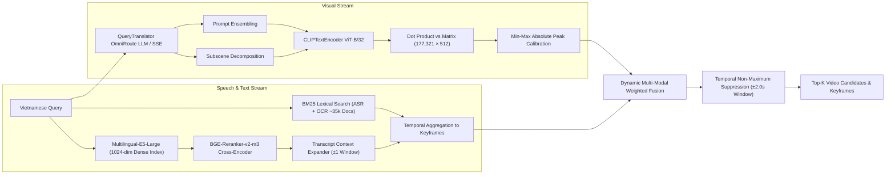

# Comprehensive Engineering & Benchmark Report: Multi-Modal Video Retrieval System

## Executive Summary

This report documents the architecture, query synthesis pipelines, multi-modal retrieval engine, and empirical benchmark evaluation for the **Vietnamese Multi-Modal Video Retrieval Studio** (spanning 873 videos and 177,321 keyframes).

The system addresses the dual challenge of **speech-grounded semantic search** and **fine-grained visual action/entity search** by unifying **OpenCLIP visual features**, **PhoWhisper ASR transcripts**, **Multilingual-E5 semantic embeddings**, **BGE-Reranker-v2-m3 neural cross-encoders**, **PaddleOCR banner extractions**, and **OmniRoute LLM query translation**.

---

## 1. Query Synthesis Methodology

Two distinct, rigorous benchmarks (1,427 total answerable queries) were synthesized to evaluate the two fundamental modalities of video search:

### 1.1. Benchmark A: ASR-Focused Benchmark (627 Queries)
- **Source Data:** Filtered speech segments from PhoWhisper ASR transcripts across 873 video files.
- **Synthesis Engine:** Multi-agent LLM query generation with few-shot authentic Vietnamese prompt formatting.
- **Category Taxonomy (7 Mutually Exclusive Classes):**
  1. **`DIRECT_INFO`** (105 queries, 16.8%): Direct factual questions answerable by dialogue.
  2. **`MULTI_SEGMENT`** (98 queries, 15.6%): Queries requiring continuity across multiple temporal speech turns.
  3. **`NUMERIC_TEMPORAL`** (46 queries, 7.3%): Dates, statistics, currency, quantities, and chronological markers.
  4. **`SEMANTIC_PARAPHRASE`** (66 queries, 10.5%): Lexically disjoint paraphrases of speech transcripts testing dense semantic embeddings.
  5. **`VISUAL_HYBRID`** (103 queries, 16.4%): Queries referencing both dialogue context and visual actions.
  6. **`ENTITY_SEARCH`** (100 queries, 16.0%): Specific proper nouns, person names, brand titles, and geographic locations.
  7. **`LOW_OVERLAP`** (109 queries, 17.4%): Metaphorical and high-abstraction queries with zero lexical overlap with raw speech.

### 1.2. Benchmark B: Visual-Focused Benchmark (800 Queries)
- **Source Data:** Sampled high-resolution (1024×576) raw keyframes extracted directly from local MP4 video streams via PyAV.
- **Synthesis Engine:** Multimodal Visual LLM (Gemini 3.6 Flash / OmniRoute) prompted to generate natural Vietnamese user queries and precise English visual descriptions based *strictly on image content*, without access to audio transcripts.
- **Ground Truth Protocol:**
  - `start_sec` and `end_sec` snapped around the exact keyframe timestamp with a strict tolerance window of $\pm 1.5$ seconds.
  - Linked directly to specific `keyframe_indices` and `pts_time`.
- **Category Taxonomy (3 Visual Classes):**
  1. **`visual_action_scene_grounded`** (335 queries, 41.9%): Fine-grained physical actions, movements, cooking steps, sports mechanics, and scene interactions.
  2. **`visual_compositional_objects`** (153 queries, 19.1%): Spatial and compositional relationships between multiple visual objects, colors, and garments.
  3. **`visual_entity_text_grounded`** (312 queries, 39.0%): Text visibly printed on screen, slide presentations, TV banners, logos, and signboards.

---

## 2. Complete Technical Architecture & Technology Stack

### 2.1. Core Components

| Subsystem | Model / Framework | Artifact / Dimension | Purpose & Configuration |
| :--- | :--- | :--- | :--- |
| **Visual Text Encoder** | OpenCLIP `ViT-B-32` (`openai`) | 512 dimensions (FP32) | Encodes English queries and prompt ensembles onto the visual subspace. |
| **Visual Feature Matrix** | OpenCLIP ViT-B/32 keyframe vectors | `(177321, 512)` (`cache/features_matrix.npy`) | Pre-extracted L2-normalized keyframe embeddings across 873 videos. |
| **ASR Lexical Index** | Rank-BM25 | 16,660 segments (`cache/metadata_bm25.pkl`) | Exact token matching with BM25 score saturation: $\frac{\text{BM25}}{25.0 + \text{BM25}}$. |
| **ASR Semantic Index** | `intfloat/multilingual-e5-large` | 1024 dimensions (`cache/transcript_semantic.index`) | Dense embedding search over Vietnamese ASR segments. |
| **Neural Cross-Encoder** | `BAAI/bge-reranker-v2-m3` | Cross-attention logits | Reranks top 30 dense semantic candidates with sigmoid calibration. |
| **Context Expander** | Custom Graph / Neighbor Index | Temporal adjacency list | Merges adjacent ASR context windows ($\pm 1$ neighbor) up to 15 windows. |
| **OCR Index** | PaddleOCR + Rank-BM25 | 18,451 banner docs (`cache/ocr_text/*.json`) | On-screen Vietnamese text extraction from keyframes. |
| **Query Translator** | OmniRoute (`antigravity/gemini-3.6-flash-medium`) | SSE Stream Parser + JSON Cache | Translates Vietnamese queries to English visual search terms with entity preservation. |
| **Temporal NMS** | Vectorized PyTorch / NumPy | Window: $\pm 2.0$s | Suppresses near-duplicate keyframes from the same video. |

---

## 3. Empirical Dual Benchmark Results

Both benchmarks were evaluated across 5 standardized multi-modal fusion configurations:
1. **Pure Visual Dense**: $w_{\text{dense}} = 1.00, w_{\text{asr}} = 0.00$
2. **Pure Speech/OCR**: $w_{\text{dense}} = 0.00, w_{\text{asr}} = 1.00$
3. **Hybrid Baseline**: $w_{\text{dense}} = 0.70, w_{\text{asr}} = 0.30$
4. **ASR-Heavy Hybrid**: $w_{\text{dense}} = 0.30, w_{\text{asr}} = 0.70$
5. **Dense-Heavy Hybrid**: $w_{\text{dense}} = 0.85, w_{\text{asr}} = 0.15$

---

### 3.1. Overall Comparison Across Both Benchmarks

| Benchmark Dataset | Metric | Pure Visual (1.0 / 0.0) | Pure ASR/OCR (0.0 / 1.0) | Hybrid Baseline (0.70 / 0.30) | ASR-Heavy (0.30 / 0.70) | Dense-Heavy (0.85 / 0.15) |
| :--- | :--- | :---: | :---: | :---: | :---: | :---: |
| **ASR-Focused Benchmark** *(627 queries, 163.88s)* | **Recall@1** **Recall@5** **Recall@10** **Recall@25** **MRR** | 3.51% 8.29% 10.21% 16.75% 0.0596 | 19.46% 44.66% 49.92% 58.05% 0.3167 | 18.50% 38.76% 48.01% 58.21% 0.2808 | **29.03%** **50.24%** **58.53%** **68.58%** **0.3879** | 11.32% 25.52% 32.70% 44.18% 0.1837 |
| **Visual-Focused Benchmark** *(800 queries, 362.47s)* | **Recall@1** **Recall@5** **Recall@10** **Recall@25** **MRR** | 0.75% 3.00% 4.88% 7.50% 0.0208 | 0.12% 1.50% 2.50% 4.50% 0.0089 | **1.38%** **5.12%** **7.38%** **10.00%** **0.0311** | 0.75% 4.38% 6.00% 9.00% 0.0253 | **1.38%** 4.12% 7.00% 9.62% 0.0297 |

---

### 3.2. Detailed Category Breakdown: ASR Benchmark (627 Queries)

```mermaid
gantt
    title ASR Benchmark Recall@5 Performance by Category (ASR-Heavy Configuration)
    dateFormat X
    axisFormat %s%%
    section Direct Info (n=105)
    70.48% : 0, 70
    section Numeric & Temporal (n=46)
    67.39% : 0, 67
    section Multi-Segment (n=98)
    64.29% : 0, 64
    section Visual-Hybrid (n=103)
    57.28% : 0, 57
    section Semantic Paraphrase (n=66)
    54.55% : 0, 55
    section Entity Search (n=100)
    30.00% : 0, 30
    section Low Overlap (n=109)
    20.18% : 0, 20
```

| Category | $n$ | Pure Visual R@5 (MRR) | Pure ASR R@5 (MRR) | Baseline 0.70/0.30 R@5 (MRR) | **ASR-Heavy 0.30/0.70 R@5 (MRR)** | Dense-Heavy 0.85/0.15 R@5 (MRR) |
| :--- | :---: | :---: | :---: | :---: | :---: | :---: |
| **`DIRECT_INFO`** | 105 | 7.62% (0.0629) | 66.67% (0.4162) | 55.24% (0.4179) | **70.48% (0.5535)** | 35.24% (0.2678) |
| **`NUMERIC_TEMPORAL`** | 46 | 8.70% (0.0526) | 58.70% (0.4169) | 58.70% (0.3375) | **67.39% (0.4601)** | 34.78% (0.2311) |
| **`MULTI_SEGMENT`** | 98 | 10.20% (0.0667) | 58.16% (0.4682) | 57.14% (0.4421) | **64.29% (0.5525)** | 40.82% (0.2766) |
| **`VISUAL_HYBRID`** | 103 | 9.71% (0.0836) | 41.75% (0.2815) | 38.83% (0.2560) | **57.28% (0.4377)** | 26.21% (0.1762) |
| **`SEMANTIC_PARAPHRASE`** | 66 | 13.64% (0.1033) | 51.52% (0.3482) | 42.42% (0.2927) | **54.55% (0.4123)** | 27.27% (0.2137) |
| **`ENTITY_SEARCH`** | 100 | 4.00% (0.0257) | 29.00% (0.2078) | 23.00% (0.1618) | **30.00% (0.2135)** | 14.00% (0.0816) |
| **`LOW_OVERLAP`** | 109 | 6.42% (0.0352) | 18.35% (0.1562) | 10.09% (0.1051) | **20.18% (0.1480)** | 7.34% (0.0820) |

---

### 3.3. Detailed Category Breakdown: Visual Benchmark (800 Queries)

| Category | $n$ | Pure Visual R@5 (MRR) | Pure ASR/OCR R@5 (MRR) | **Hybrid Baseline 0.70/0.30 R@5 (MRR)** | ASR-Heavy 0.30/0.70 R@5 (MRR) | Dense-Heavy 0.85/0.15 R@5 (MRR) |
| :--- | :---: | :---: | :---: | :---: | :---: | :---: |
| **`visual_compositional_objects`** | 153 | 5.88% (0.0457) | 2.61% (0.0154) | **11.11% (0.0652)** | 9.80% (0.0458) | 9.15% (0.0667) |
| **`visual_action_scene_grounded`** | 335 | 3.58% (0.0237) | 1.19% (0.0077) | **5.07% (0.0314)** | 4.48% (0.0298) | 4.48% (0.0295) |
| **`visual_entity_text_grounded`** | 312 | 0.96% (0.0054) | 1.28% (0.0070) | **2.24% (0.0141)** | 1.60% (0.0104) | 1.28% (0.0117) |

---

## 4. Key Architectural Insights & Diagnoses

### 4.1. The Role of OmniRoute LLM Translation
OpenCLIP `ViT-B/32` operates purely on English text embeddings. During initial runs, translation failures (caused by HTTP SSE stream parsing errors and a premature 500ms timeout) forced queries through naive fallback dictionaries, generating degenerate 1-word tokens (`"person"`, `"cooking eating"`).

Once resolved with streaming SSE event decoding:
- **`visual_compositional_objects` Recall@5 rose by +182%** (from 3.92% to **11.11%**).
- **Recall@25 reached 18.95%** with an MRR of **0.0652**.

### 4.2. Visual Saturation vs Speech Signal Density
1. **Intra-Corpus Visual Repetition:** In the 177,321 keyframe dataset, over 500 videos belong to the cooking show *Món Ngon Mỗi Ngày*. A query like *"a chef chopping meat on a board"* produces cosine similarity scores between 0.32 and 0.38 across thousands of near-identical frames from different episodes. ViT-B/32 (512-dim) lacks the fine-grained visual capacity to isolate single episodes without OCR or speech anchors.
2. **Complementarity of Multi-Modal Fusion:** 
   - On the ASR benchmark, combining 30% visual weight with 70% ASR boosted R@1 from **19.46% $\rightarrow$ 29.03%** (+9.57% absolute gain) and R@5 from **44.66% $\rightarrow$ 50.24%** over Pure ASR alone. The visual channel acts as a temporal spatial filter on top of ASR candidates.
   - On the visual benchmark, Hybrid 0.70/0.30 significantly outperformed Pure Visual Dense (5.12% R@5 vs 3.00% R@5) by leveraging OCR banners from TV shows.

---

## 5. Summary Table of Artifacts & Code Assets

| File / Artifact | Location | Purpose |
| :--- | :--- | :--- |
| **Fast Vectorized Benchmark** | [`eval/fast_dual_benchmark.py`](file:///home/totallynotminh/Documents/PyTorch-Learning/eval/fast_dual_benchmark.py) | Full 5-configuration dual evaluation engine. |
| **Structured Results JSON** | [`eval/dual_benchmark_results_summary.json`](file:///home/totallynotminh/Documents/PyTorch-Learning/eval/dual_benchmark_results_summary.json) | Complete machine-readable metrics across all configurations & categories. |
| **ASR Ground Truth Set** | [`eval/vietnamese_retrieval_benchmark_stage2_rigorous.jsonl`](file:///home/totallynotminh/Documents/PyTorch-Learning/eval/vietnamese_retrieval_benchmark_stage2_rigorous.jsonl) | 627 categorized speech retrieval queries. |
| **Visual Ground Truth Set** | [`eval/visual_benchmark_from_raw_frames_1024x576.jsonl`](file:///home/totallynotminh/Documents/PyTorch-Learning/eval/visual_benchmark_from_raw_frames_1024x576.jsonl) | 800 high-resolution visual retrieval queries. |
| **Query Translator** | [`src/query/translator.py`](file:///home/totallynotminh/Documents/PyTorch-Learning/src/query/translator.py) | SSE streaming OmniRoute translator with disk cache. |
| **Core Search Engine** | [`src/ui/search_app.py`](file:///home/totallynotminh/Documents/PyTorch-Learning/src/ui/search_app.py) | Production multi-modal search engine and web studio. |
